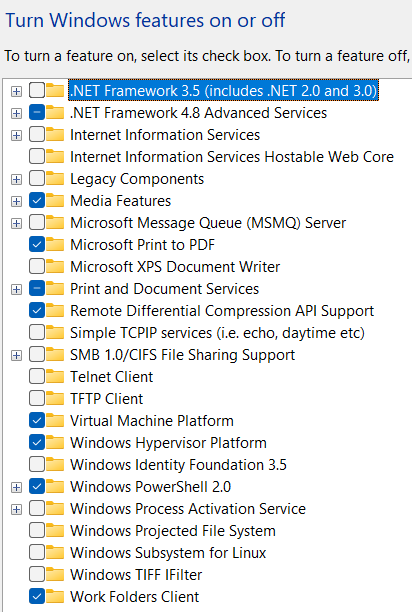

# BASIC COMMANDS
- pwd : Print working directory
- ls : List the files
- mkdir : Make/Create a directory/folder
- pwd : Print Working directory
- cd : Change Directory
- touch : create an empty file
- cp : copy file
- mv : move file

```
pwd
ls
mkdir test
cd
touch test.txt
cp abc.txt 123.txt
mv 123.txt abc.txt
```
# CRUD - Create Read Update Delete
- C - mkdir CLI_Folder
- R - ls
- U -
- D - rmdir CLI_Folder for empty folder or
- rm -r CLI_Folder for folder wtith data
```
mkdir test2
cd test2
touch test3.txt
rm -r test2
```
# Adding text into a file
- touch file.txt -> Create a file called file.txt in the current working directory
- vi file.txt -> text editor view command
    - i - insert the data
    - Esc - to come out of insert mode
    - :w - save the data
    - :q - Quit the data
- cat file.txt -> read contents of a file
```
touch 1.txt
vi 2.txt
i
### add some data
ESC
:w
:q
hostname -I
hostname -i
```
# ls Command
```
ls -l
ls -la
ls -ls
ls -lsr
ls -lt
ls -ltr
ls -lh
```
# Install VB & Ubuntu(ISO)
- [Download VirtualBOX](https://download.virtualbox.org/virtualbox/7.1.8/VirtualBox-7.1.8-168469-Win.exe)
- [Download ISO for Ubuntu](https://ubuntu.com/download/desktop/thank-you?version=24.04.2&architecture=amd64&lts=true)
# Upload a pic
- 
# User Management
- sudo add user <> --> To add the user into your machine. <username>
- sudo login <> --> To login to the newlu added user/Another user. <username>
- sudo userdel <> --> To delete the user from your machine. <username>
- sudo cat /etc/shadow--> To check the users list. users will be found at /etc, /shadow, /group
- sudo usermod <> --password --> To change the user's password.
```
sudo adduser Kiran
sudo login Kiran
sudo userdel Kirn
sudo cat /etc/shadow
sudo cat /etc/group
sudo usermod Kiran --password
```


  
